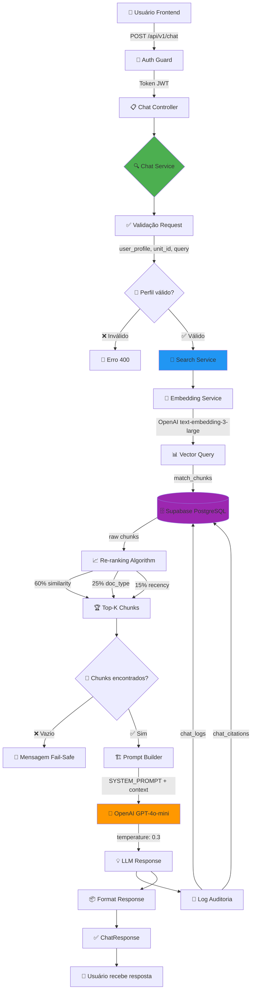

# 🔄 FLUXO COMPLETO DO CHAT CONVERSACIONAL

Este documento detalha o fluxo end-to-end do nosso sistema de chat, desde a requisição do usuário até a resposta com citações.

---

## 📊 DIAGRAMA DE ARQUITETURA (MERMAID)



---

## 🔢 FLUXO DETALHADO (PASSO A PASSO)

### **FASE 1: RECEPÇÃO E VALIDAÇÃO** 🔐

```
1.1 Frontend → POST /api/v1/chat
    Body: {
      user_id: "abc-123",
      user_profile: "DIRETOR",
      unit_id: "unidade-01",
      query: "Qual o calendário escolar 2026?"
    }

1.2 Auth Guard verifica JWT
    ✅ Token válido → Extrai user_id
    ❌ Token inválido → 401 Unauthorized

1.3 Chat Controller delega para Chat Service
```

**Arquivos envolvidos:**
- `routes/chat.routes.ts`
- `middlewares/authGuard.ts`
- `controllers/chat.controller.ts`

---

### **FASE 2: VALIDAÇÃO DE PERFIL E GOVERNANÇA** ✅

```typescript
// chat.service.ts:263-275
validateRequest(request) {
  ✅ Query tem 3+ caracteres?
  ✅ Query tem <500 caracteres?
  ✅ Perfil é válido? (DIRETOR|COMISSAO|SECRETARIA|TI)
  ✅ Se DIRETOR → unit_id obrigatório?
}
```

**Regras de governança:**
- DIRETOR → Vê apenas documentos da sua unidade
- COMISSAO → Vê documentos públicos + restritos específicos
- SECRETARIA/TI → Vê tudo

**Falha aqui = 400 Bad Request**

---

### **FASE 3: BUSCA SEMÂNTICA (RAG)** 🔎

```
3.1 Chat Service chama Search Service
    SearchQuery {
      query: "Qual o calendário escolar 2026?",
      user_id: "abc-123",
      user_profile: "DIRETOR",
      unit_id: "unidade-01",
      filters: {
        max_results: 8
      }
    }

3.2 Search Service gera embedding da query
    ↓ Embedding Service
    ↓ OpenAI text-embedding-3-large (1536 dimensões)
    ↓ Vector: [0.123, -0.456, ...]

3.3 Executa match_chunks() no Supabase
    SELECT *
    FROM match_chunks(
      embedding_vector,
      threshold_dinamico,  -- Calculado por perfil
      max_results,
      unit_id_filter       -- Governança automática
    )
    
    Retorna: ~8-10 chunks relevantes

3.4 Re-ranking inteligente
    Para cada chunk:
      score = (similarity * 0.6) +
              (doc_type_weight * 0.25) +
              (recency_score * 0.15)
    
    Ordena por score final (decrescente)
```

**Arquivos envolvidos:**
- `services/search.service.ts:80-169`
- `services/embedding.service.ts`
- Database: `match_chunks()` RPC

**Custos:**
- Embedding: ~$0.00013 (1 query)
- Busca: Grátis (PostgreSQL)

---

### **FASE 4: CONSTRUÇÃO DO PROMPT** 🏗️

```typescript
// master.prompt.ts:164-222
buildChatPrompt(context) {
  return `
${SYSTEM_PROMPT}
  
## PERFIL DO USUÁRIO
Perfil: ${context.user_profile}
Unidade: ${context.unit_name || 'N/A'}

## CONTEXTO FORNECIDO
Os seguintes trechos de documentos oficiais foram encontrados:

${context.chunks.map((chunk, i) => `
### Fonte ${i+1}: ${chunk.source.document_name}
Tipo: ${chunk.source.document_type}
Relevância: ${(chunk.similarity * 100).toFixed(1)}%

**Conteúdo:**
${chunk.content}
`).join('\n\n')}

## PERGUNTA DO USUÁRIO
${context.query}

## SUA RESPOSTA
Responda de forma objetiva, citando as fontes utilizadas.
  `;
}
```

**Componentes do prompt:**
1. SYSTEM_PROMPT (286 linhas) - Identidade e regras
2. Perfil do usuário - Contexto institucional
3. Chunks encontrados - Fontes oficiais
4. Pergunta - Query original
5. Instruções finais - Formato de resposta

---

### **FASE 5: CHAMADA AO LLM** 🤖

```typescript
// chat.service.ts:295-339
generateLLMResponse(context) {
  const response = await openai.chat.completions.create({
    model: 'gpt-4o-mini',
    messages: [
      { role: 'system', content: SYSTEM_PROMPT },
      { role: 'user', content: userPrompt }
    ],
    temperature: 0.3,        // Determinístico
    max_tokens: 800,         // Respostas concisas
    top_p: 0.9,
    frequency_penalty: 0.2,
    presence_penalty: 0.1
  });
  
  return {
    answer: response.choices[0].message.content,
    tokens_input: response.usage.prompt_tokens,
    tokens_output: response.usage.completion_tokens,
    cost: calculateCost(tokens_input, tokens_output)
  };
}
```

**Cálculo de custo:**
- Input: $0.150 / 1M tokens
- Output: $0.600 / 1M tokens
- Exemplo: 2000 tokens input + 500 output = $0.0006

---

### **FASE 6: PERSISTÊNCIA E AUDITORIA** 💾

```typescript
// chat.service.ts:360-449
logChat(request, searchResult, llmResponse, answer) {
  // 1. Gravar chat_logs
  INSERT INTO chat_logs (
    user_id,
    user_profile,
    unit_id,
    query_text,
    response_text,
    chunks_found,
    tokens_input,
    tokens_output,
    cost_search,
    cost_llm,
    cost_total,
    model_used,
    prompt_version,
    duration_ms
  ) VALUES (...);
  
  // 2. Gravar chat_citations (uma por chunk usado)
  INSERT INTO chat_citations (
    chat_log_id,
    document_id,
    chunk_id,
    similarity_score
  ) VALUES (...);
}
```

**Dados auditáveis:**
- ✅ Quem perguntou (user_id)
- ✅ Quando perguntou (created_at)
- ✅ O que perguntou (query_text)
- ✅ Resposta dada (response_text)
- ✅ Chunks usados (chat_citations)
- ✅ Custos detalhados (search + LLM)
- ✅ Performance (duration_ms)
- ✅ Versão do prompt (rastreabilidade)

---

### **FASE 7: FORMATAÇÃO E RESPOSTA** 📦

```typescript
// chat.service.ts:189-225
return {
  success: true,
  answer: "Segundo o Calendário Escolar 2026...",
  sources: [
    {
      document_id: "doc-123",
      document_name: "Calendário Escolar 2026",
      document_type: "CALENDAR",
      chunk_content: "O ano letivo de 2026...",
      similarity: 0.92
    }
  ],
  metadata: {
    query: "Qual o calendário escolar 2026?",
    user_profile: "DIRETOR",
    chunks_found: 8,
    tokens_input: 2156,
    tokens_output: 324,
    tokens_total: 2480,
    cost_search: 0.00013,
    cost_llm: 0.00045,
    cost_total: 0.00058,
    model: "gpt-4o-mini",
    prompt_version: "1.0",
    duration_ms: 1847
  }
};
```

**Frontend recebe:**
- ✅ Resposta formatada com citações
- ✅ Lista de documentos fonte
- ✅ Métricas detalhadas
- ✅ Custo da operação

---

## 🎯 CASOS ESPECIAIS

### **CASO 1: Nenhum chunk encontrado** ❌

```
match_chunks() retorna vazio
↓
buildNoChunksResponse()
↓
Retorna:
{
  success: true,
  answer: "Não encontrei informações sobre sua pergunta...",
  sources: [],
  metadata: { chunks_found: 0, ... }
}
```

**NÃO chama LLM** = Custo zero

---

### **CASO 2: Query inválida** ⚠️

```
validateRequest() falha
↓
throw Error('INVALID_QUERY: ...')
↓
Retorna:
{
  success: false,
  answer: "Por favor, faça uma pergunta mais específica.",
  sources: [],
  error: "INVALID_QUERY"
}
```

**NÃO executa busca nem LLM**

---

### **CASO 3: Perfil DIRETOR sem unidade** 🚫

```
validateRequest() detecta:
  user_profile === 'DIRETOR' && !unit_id
↓
throw Error('INVALID_REQUEST: Diretor deve ter unidade vinculada')
↓
Retorna 400 Bad Request
```

**Governança impediu acesso indevido**

---

## 📊 MÉTRICAS E CUSTOS

### **Por requisição:**
- Embedding: ~$0.00013
- LLM: ~$0.0004 - $0.0008
- **Total: ~$0.0006** (média)

### **Tempo de resposta:**
- Busca: ~200-400ms
- LLM: ~800-1500ms
- **Total: ~1-2 segundos**

### **Escalabilidade:**
- 1000 queries/dia = ~$0.60/dia = $18/mês
- 10000 queries/dia = ~$6/dia = $180/mês

---

## 🔒 GOVERNANÇA IMPLEMENTADA

### **Filtros automáticos por perfil:**

| Perfil | Vê documentos | Unit filter? |
|--------|---------------|--------------|
| **TI** | Todos | ❌ Não |
| **SECRETARIA** | Todos | ❌ Não |
| **COMISSAO** | Públicos + restritos específicos | ❌ Não |
| **DIRETOR** | Públicos + da sua unidade | ✅ Sim |

### **Nunca vazam informações:**
- ✅ match_chunks() filtra automaticamente
- ✅ Chunks já vêm filtrados por perfil
- ✅ LLM não tem acesso a documentos fora do escopo

---

## ✅ CHECKLIST DE QUALIDADE

- [x] Stateless (cada query é independente)
- [x] Auditável (logs + citations)
- [x] Governança automática (perfil + unidade)
- [x] Citações obrigatórias
- [x] Custos rastreados
- [x] Performance medida
- [x] Erros tratados
- [x] Fail-safe para casos especiais
- [x] Prompt versionado
- [x] Re-ranking inteligente

---

**Última atualização:** 13 de Janeiro de 2026  
**Responsável:** Sistema de Chat Conversacional  
**Status:** ✅ **PRODUÇÃO - FASE 3 COMPLETA**
