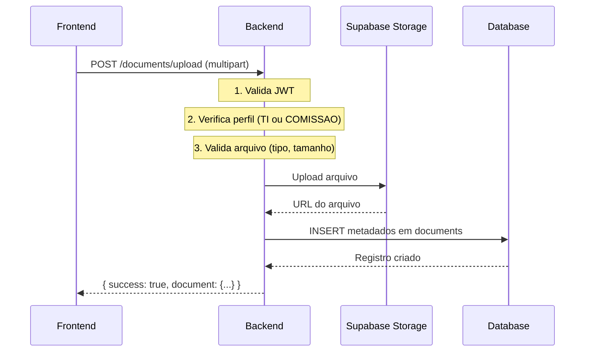

# 📦 Configuração do Supabase Storage - Base de Conhecimento

**Data:** 09/01/2026  
**Objetivo:** Armazenamento seguro de documentos institucionais

---

## 🎯 Arquitetura de Storage

```
┌─────────────────────────────────────────────────────────────────┐
│                         FRONTEND                                  │
│                  (Nunca acessa storage direto)                    │
└────────────────────────────┬────────────────────────────────────┘
                             │
                  HTTP/REST (multipart/form-data)
                             │
                             ▼
┌─────────────────────────────────────────────────────────────────┐
│                         BACKEND                                   │
│                  (Service Role Key)                               │
├─────────────────────────────────────────────────────────────────┤
│  1. Valida arquivo (tipo, tamanho, perfil)                       │
│  2. Upload para Supabase Storage                                 │
│  3. Grava metadados na tabela documents                          │
│  4. Retorna sucesso/erro                                         │
└────────────────────────────┬────────────────────────────────────┘
                             │
                      Supabase Client (service_role)
                             │
                             ▼
┌─────────────────────────────────────────────────────────────────┐
│                    SUPABASE STORAGE                               │
│                    (Bucket privado)                               │
├─────────────────────────────────────────────────────────────────┤
│  📦 institutional-documents/                                      │
│     ├── norms/                                                    │
│     ├── laws/                                                     │
│     ├── resolutions/                                              │
│     ├── directives/                                               │
│     ├── manuals/                                                  │
│     ├── reports/                                                  │
│     └── others/                                                   │
└─────────────────────────────────────────────────────────────────┘
```

---

## ⚙️ PASSO A PASSO - Configuração Manual

### 1️⃣ Acessar Supabase Dashboard

1. Entre em: https://app.supabase.com
2. Selecione seu projeto
3. Vá em: **Storage** (menu lateral esquerdo)

### 2️⃣ Criar Bucket Principal

Clique em **"New bucket"** e configure:

```
Nome: institutional-documents
Público: NÃO (Private)
File size limit: 52428800 (50 MB)
Allowed MIME types: deixe vazio (controle no backend)
```

**⚠️ IMPORTANTE:** Bucket DEVE ser **PRIVATE** (não público)

### 3️⃣ Configurar Políticas de Storage (RLS)

No bucket `institutional-documents`, clique em **"Policies"** e adicione:

#### Política 1: Backend pode fazer upload (INSERT)

```sql
CREATE POLICY "Backend can upload documents"
ON storage.objects FOR INSERT
TO authenticated
WITH CHECK (
  bucket_id = 'institutional-documents'
  AND auth.jwt() ->> 'role' = 'service_role'
);
```

#### Política 2: Backend pode ler arquivos (SELECT)

```sql
CREATE POLICY "Backend can read documents"
ON storage.objects FOR SELECT
TO authenticated
USING (
  bucket_id = 'institutional-documents'
  AND auth.jwt() ->> 'role' = 'service_role'
);
```

#### Política 3: Backend pode atualizar arquivos (UPDATE)

```sql
CREATE POLICY "Backend can update documents"
ON storage.objects FOR UPDATE
TO authenticated
USING (
  bucket_id = 'institutional-documents'
  AND auth.jwt() ->> 'role' = 'service_role'
);
```

#### Política 4: Backend pode deletar arquivos (DELETE)

```sql
CREATE POLICY "Backend can delete documents"
ON storage.objects FOR DELETE
TO authenticated
USING (
  bucket_id = 'institutional-documents'
  AND auth.jwt() ->> 'role' = 'service_role'
);
```

**👉 Essas políticas garantem que APENAS o backend (com service_role key) pode acessar o storage.**

### 4️⃣ Estrutura de Pastas (Criadas Automaticamente pelo Backend)

O backend criará automaticamente as pastas por tipo de documento:

```
institutional-documents/
├── norms/          (Normas/Regulamentos)
├── laws/           (Leis)
├── resolutions/    (Resoluções)
├── directives/     (Portarias/Diretrizes)
├── manuals/        (Manuais operacionais)
├── reports/        (Relatórios)
└── others/         (Outros tipos)
```

### 5️⃣ Configurar Variáveis de Ambiente

No arquivo `backend/.env`, adicione/verifique:

```env
# Supabase Storage (já existentes)
SUPABASE_URL=https://[seu-projeto].supabase.co
SUPABASE_KEY=[sua-chave-anon]
SUPABASE_SERVICE_ROLE_KEY=[sua-service-role-key]

# Configurações de Upload (ADICIONAR)
MAX_FILE_SIZE=52428800           # 50 MB em bytes
ALLOWED_FILE_TYPES=application/pdf,application/msword,application/vnd.openxmlformats-officedocument.wordprocessingml.document,text/markdown
STORAGE_BUCKET=institutional-documents
```

---

## 🔒 Regras de Segurança

### ✅ Princípios Obrigatórios

1. **Frontend NUNCA acessa storage diretamente**
   - Sempre via backend
   - Service role key fica APENAS no backend

2. **Bucket é PRIVATE**
   - Não há URLs públicas
   - Acesso controlado por backend

3. **Backend valida TUDO antes de upload**
   - Tipo de arquivo (PDF, DOCX, MD)
   - Tamanho (max 50 MB)
   - Perfil do usuário (TI ou COMISSAO)

4. **Metadados separados do conteúdo**
   - Arquivo → Supabase Storage
   - Metadados → Tabela `documents`
   - Nunca salvar conteúdo no banco

5. **Soft delete**
   - Arquivo nunca é apagado de verdade
   - Apenas status muda para 'ARCHIVED'

---

## 📊 Tipos de Arquivo Permitidos

| Tipo | MIME Type | Extensão | Tamanho Máx |
|------|-----------|----------|-------------|
| PDF | application/pdf | .pdf | 50 MB |
| Word (novo) | application/vnd.openxmlformats-officedocument.wordprocessingml.document | .docx | 50 MB |
| Word (antigo) | application/msword | .doc | 50 MB |
| Markdown | text/markdown | .md | 10 MB |

**⚠️ Validação acontece no backend, não no frontend**

---

## 🔄 Fluxo de Upload Completo

### Passo a Passo



### 1. Frontend Envia (Exemplo)

```typescript
const formData = new FormData();
formData.append('file', fileObject);
formData.append('name', 'Lei Municipal 1234/2024');
formData.append('description', 'Regulamenta...');
formData.append('document_type', 'LAW');

const response = await documentService.upload(formData);
```

### 2. Backend Processa

```typescript
// Valida JWT (authGuard)
// Valida perfil (adminGuard ou comissaoGuard)
// Valida arquivo
const file = req.file;
if (!file) throw new Error('Arquivo não enviado');
if (file.size > MAX_FILE_SIZE) throw new Error('Arquivo muito grande');
if (!ALLOWED_TYPES.includes(file.mimetype)) throw new Error('Tipo não permitido');

// Upload para Storage
const folder = getFolder(document_type); // 'laws', 'norms', etc.
const fileName = `${folder}/${uuid()}-${file.originalname}`;
const { data, error } = await supabase.storage
  .from('institutional-documents')
  .upload(fileName, file.buffer, { contentType: file.mimetype });

// Salva metadados no banco
const document = await db.documents.create({
  name: req.body.name,
  description: req.body.description,
  document_type: req.body.document_type,
  file_url: data.path,
  file_type: file.mimetype,
  file_size: file.size,
  status: 'PENDING',
  uploaded_by: req.user.id
});

return res.json({ success: true, document });
```

### 3. Banco Salva Metadados

```sql
INSERT INTO documents (
  id, name, description, document_type,
  file_url, file_type, file_size,
  status, uploaded_by
) VALUES (
  '...', 'Lei 1234/2024', 'Regulamenta...', 'LAW',
  'laws/abc123-lei1234.pdf', 'application/pdf', 2048576,
  'PENDING', 'user-uuid'
);
```

**👉 Arquivo está no Storage, metadados no banco, status PENDING esperando aprovação.**

---

## 🎯 Estados do Documento

| Status | Descrição | Visível para IA? | Visível para usuários? |
|--------|-----------|------------------|------------------------|
| **PENDING** | Upload feito, aguardando aprovação | ❌ Não | ⚠️ Apenas TI/COMISSAO |
| **ACTIVE** | Aprovado e ativo | ✅ Sim (futuro) | ✅ Sim (conforme permissão) |
| **INACTIVE** | Desativado temporariamente | ❌ Não | ⚠️ Apenas TI/COMISSAO |
| **ARCHIVED** | "Excluído" (soft delete) | ❌ Não | ❌ Não aparece |

### Transições de Status

```
PENDING --[aprovar]--> ACTIVE
ACTIVE --[desativar]--> INACTIVE
INACTIVE --[ativar]--> ACTIVE
ACTIVE/INACTIVE --[excluir]--> ARCHIVED
```

**⚠️ Nenhum documento é realmente deletado do storage. Apenas status muda.**

---

## 🧪 Testes de Validação

### Teste 1: Upload via Backend

```bash
# Com usuário TI ou COMISSAO autenticado
curl -X POST http://localhost:3001/api/v1/documents/upload \
  -H "Authorization: Bearer [token]" \
  -F "file=@documento.pdf" \
  -F "name=Teste de Upload" \
  -F "description=Teste" \
  -F "document_type=MANUAL"

# Resposta esperada: 200 OK com metadados do documento
```

### Teste 2: Tentar Upload Direto no Storage (DEVE FALHAR)

```javascript
// Frontend tentando upload direto (DEVE DAR ERRO)
const { data, error } = await supabase.storage
  .from('institutional-documents')
  .upload('test.pdf', file);

// Resultado esperado: ERRO de permissão
// Storage RLS bloqueia porque não é service_role
```

### Teste 3: Verificar Arquivo no Storage

1. Supabase Dashboard → Storage → institutional-documents
2. Deve aparecer o arquivo na pasta correta
3. Clicar no arquivo → deve aparecer URL temporária

### Teste 4: Verificar Metadados no Banco

```sql
SELECT * FROM documents WHERE name = 'Teste de Upload';
-- Deve retornar 1 registro com status PENDING
```

---

## 📁 Estrutura de Arquivos Backend (A Criar)

```
backend/
├── src/
│   ├── services/
│   │   └── storage.service.ts        # NOVO: Gerencia upload/download do Storage
│   ├── controllers/
│   │   └── document.controller.ts    # NOVO: Controla operações de documentos
│   ├── routes/
│   │   └── document.routes.ts        # NOVO: Rotas /api/v1/documents/*
│   ├── middleware/
│   │   └── upload.middleware.ts      # NOVO: Multer para multipart/form-data
│   └── utils/
│       └── file-validation.ts        # NOVO: Valida tipos/tamanhos
```

---

## ✅ Checklist de Configuração

- [ ] Bucket `institutional-documents` criado
- [ ] Bucket configurado como PRIVATE
- [ ] 4 políticas RLS criadas no Storage
- [ ] Variáveis de ambiente configuradas em `.env`
- [ ] Service role key NUNCA exposta no frontend
- [ ] Testes de upload funcionando
- [ ] Metadados salvando corretamente no banco
- [ ] Validações de tipo/tamanho funcionando

---

## 🚨 O QUE NÃO FAZER

❌ **NUNCA** expor service_role_key no frontend  
❌ **NUNCA** permitir upload direto do frontend para storage  
❌ **NUNCA** fazer bucket público  
❌ **NUNCA** salvar conteúdo de arquivo no banco  
❌ **NUNCA** deletar arquivo de verdade (usar soft delete)  
❌ **NUNCA** processar embeddings agora (isso é próxima etapa)  
❌ **NUNCA** chamar OpenAI agora (isso é próxima etapa)

---

## 📖 Referências

- [Supabase Storage Docs](https://supabase.com/docs/guides/storage)
- [Storage RLS](https://supabase.com/docs/guides/storage/security/access-control)
- [Upload Files](https://supabase.com/docs/guides/storage/uploads/standard-uploads)

---

**✅ Após concluir este setup, o sistema estará pronto para implementação do backend de upload.**
